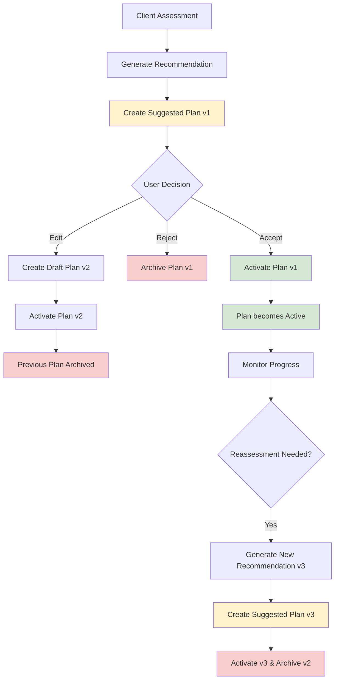
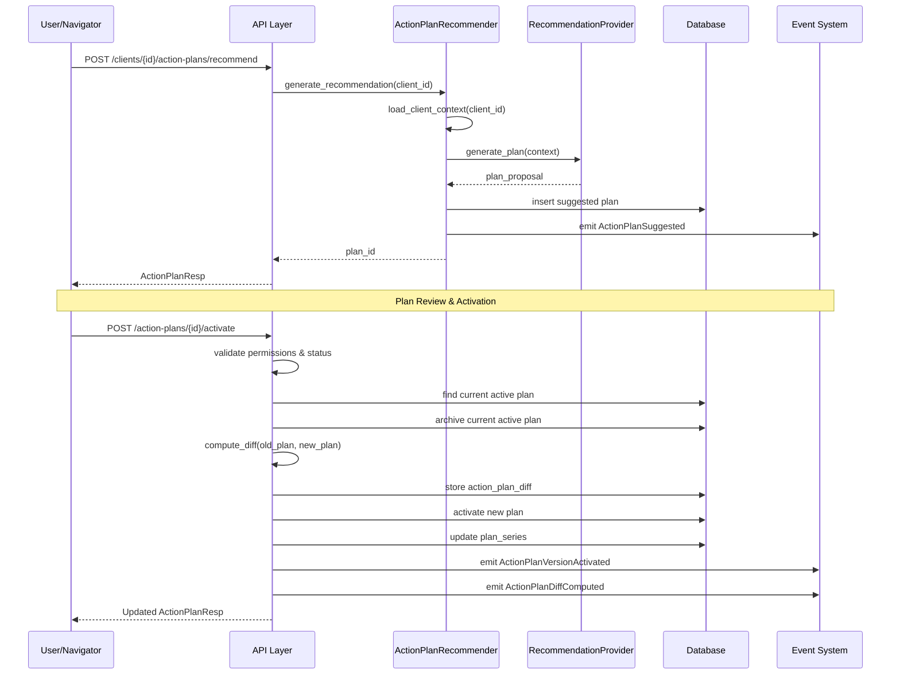
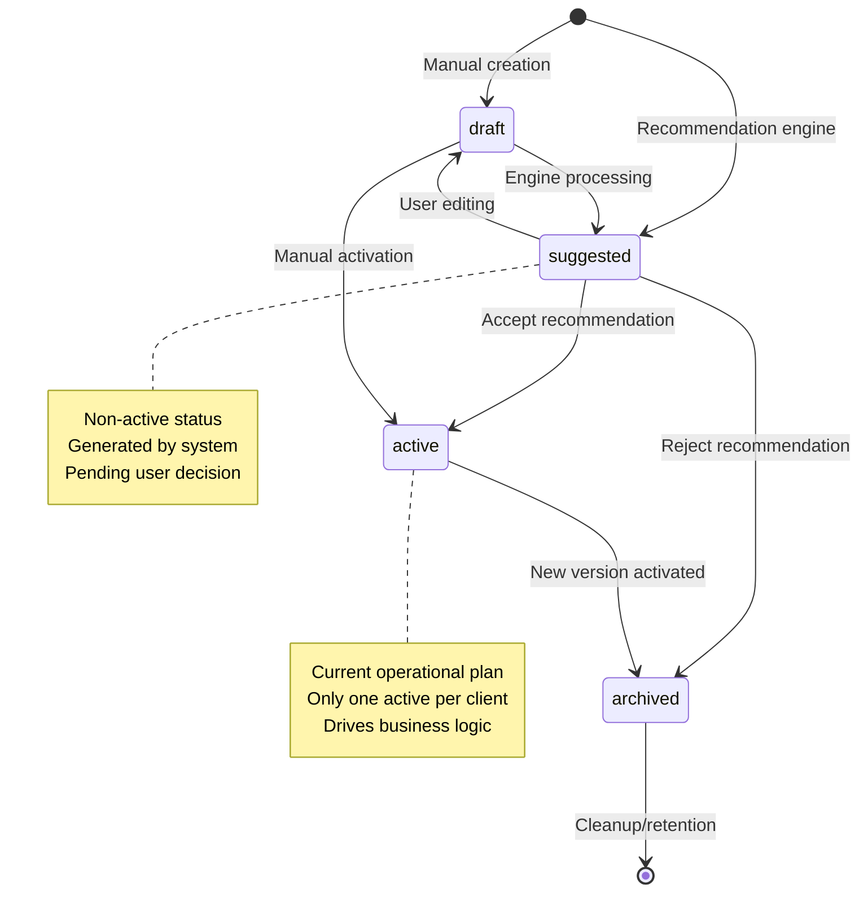

# Action Plan Versioning & Recommendation Engine Architecture

## Overview

The Action Plan Versioning & Recommendation Engine provides immutable version history, differential computation utilities, plan recommendation pipeline, and plan merge/adoption mechanics to enable AI-assisted care planning for the Polaris platform.

## System Architecture

### Core Components

1. **Action Plan Models**
   - `ActionPlan`: Immutable versioned plans with status tracking
   - `PlanSeries`: Quick lookup for active plans per client
   - `ActionPlanDiff`: Structural differences between plan versions

2. **Recommendation Engine**
   - `RecommendationProvider`: Interface for pluggable recommendation providers
   - `RuleBasedBaselineRecommendationProvider`: Heuristic rule-based implementation
   - `ActionPlanRecommender`: Orchestration service

3. **Domain Events**
   - `ActionPlanSuggested`: When a new plan is recommended
   - `ActionPlanVersionCreated`: When a new version is created
   - `ActionPlanVersionActivated`: When a plan is activated
   - `ActionPlanDiffComputed`: When differences are calculated

## Plan Version Lineage



## Recommendation Workflow Sequence



## Data Models

### ActionPlan

```json
{
  "id": "uuid",
  "client_id": "client_uuid",
  "version": 1,
  "status": "suggested|draft|active|archived",
  "goals": [
    {
      "id": "goal_1",
      "title": "Improve financial management",
      "description": "Implement comprehensive financial tracking and reporting",
      "target_metrics": {
        "completion_rate": 100,
        "improvement_percentage": 25
      },
      "timeframe": "3 months",
      "assigned_roles": ["client", "financial_advisor"]
    }
  ],
  "interventions": [
    {
      "id": "intervention_1",
      "goal_id": "goal_1",
      "title": "Financial software implementation",
      "description": "Deploy and configure accounting software",
      "type": "tool_adoption",
      "resources_required": ["software_license", "training", "support"],
      "estimated_duration": "4-6 weeks"
    }
  ],
  "generated_by_type": "rule_engine",
  "supersedes_id": "previous_plan_uuid",
  "metadata": {
    "rationale": ["Based on high risk assessment"],
    "source_tags": ["rule_engine", "high_risk"],
    "generation_context": {
      "risk_score": 80,
      "readiness_percent": 25
    }
  },
  "created_at": "2024-01-01T00:00:00Z",
  "updated_at": "2024-01-01T00:00:00Z"
}
```

### ActionPlanDiff

```json
{
  "id": "diff_uuid",
  "from_plan_id": "plan_v1_uuid",
  "to_plan_id": "plan_v2_uuid",
  "summary_json": {
    "added": {
      "goals": [],
      "interventions": [
        {
          "id": "new_intervention",
          "title": "Additional compliance measure"
        }
      ]
    },
    "removed": {
      "goals": [
        {
          "id": "old_goal",
          "title": "Deprecated objective"
        }
      ],
      "interventions": []
    },
    "changed": {
      "goals": [
        {
          "id": "goal_1",
          "fields_changed": ["title", "target_metrics"]
        }
      ],
      "interventions": []
    }
  },
  "created_at": "2024-01-01T00:00:00Z"
}
```

### Recommendation Rationale

```json
{
  "rationale": [
    "Based on high risk assessment (score: 80)",
    "Readiness level at 25% indicates need for foundational improvements",
    "Assessment gaps identified in: financial_management, compliance"
  ],
  "source_tags": ["rule_engine", "high_risk", "automated_recommendation"],
  "generation_context": {
    "client_id": "client_uuid",
    "risk_score": 80,
    "readiness_percent": 25,
    "assessment_gaps": ["financial_management", "compliance"],
    "industry": "technology"
  }
}
```

## Status Transitions



## API Endpoints

### Core Endpoints

1. **POST** `/clients/{id}/action-plans/recommend`
   - Generates recommended action plan
   - Requires `RECOMMEND_ACTION_PLAN` permission
   - Returns suggested plan in pending state

2. **POST** `/action-plans/{id}/activate`
   - Activates suggested/draft plan
   - Archives previous active plan
   - Computes and stores diff
   - Requires `CREATE_ACTION_PLAN` permission

3. **GET** `/action-plans/{id}/diffs`
   - Retrieves plan version differences
   - Shows both forward and backward diffs
   - Requires `VIEW_PLAN_DIFFS` permission

4. **GET** `/clients/{id}/action-plans`
   - Lists client's action plans
   - Optional status filtering
   - Version-ordered results

### Response Examples

```json
{
  "action_plans": [
    {
      "id": "plan_uuid",
      "client_id": "client_uuid", 
      "version": 2,
      "status": "active",
      "goals": [...],
      "interventions": [...],
      "supersedes_id": "previous_plan_uuid",
      "created_at": "2024-01-01T00:00:00Z"
    }
  ]
}
```

## Permissions & RBAC

### New Permissions

- `RECOMMEND_ACTION_PLAN`: Generate recommendations
- `VIEW_PLAN_DIFFS`: Access version differences
- `ACTIVATE_ACTION_PLAN`: Activate pending plans

### Role Mappings

| Role | Recommend | View Diffs | Activate | Create Manual |
|------|-----------|------------|----------|---------------|
| Navigator | ✅ | ✅ | ✅ | ✅ |
| Agency | ✅ | ✅ | ✅ | ✅ |
| Client | ❌ | ✅ | ✅ | ✅ |
| Provider | ❌ | ❌ | ❌ | ❌ |

## Configuration

### Rules Configuration (`config/rules/recommendations.yaml`)

```yaml
risk_score_thresholds:
  high:
    min: 75
    goals:
      - "Strengthen financial management systems"
      - "Implement comprehensive compliance framework"
    interventions:
      financial_management:
        type: "training"
        duration: "8 weeks"
        resources: ["financial_advisor", "accounting_software"]

  medium:
    min: 50
    goals:
      - "Standardize operational processes"
      - "Improve documentation practices"

  low:
    min: 0
    goals:
      - "Maintain current operational standards"
      - "Pursue growth opportunities"
```

## Observability & Metrics

### Metrics Tracked

- `recommendation_requests_total{provider, result}`: Total recommendation requests
- `plan_diff_computations_total`: Number of diffs computed
- `plan_version_activation_total{source}`: Plan activations by source

### Logging Events

- Plan suggestion generation
- Version activation with supersession
- Diff computation completion
- Permission validation failures

### Tracing Spans

- Recommendation provider execution
- Diff computation algorithms
- Database transaction boundaries

## Implementation Notes

### Version Management

- Versions auto-increment per client using database sequence
- Each version is immutable once created
- Plan series table maintains current active pointer for performance

### Diff Algorithm

- Canonical ordering by goal/intervention ID for determinism
- Deep comparison for changed fields (title, description, target_metrics, etc.)
- Stable identifiers prevent false positives in change detection

### Transaction Integrity

- Plan activation + archival + diff creation in single atomic operation
- Outbox pattern for reliable event emission
- Rollback capability for failed activations

### Future Enhancements

- Advanced AI/ML model integration
- Multi-provider ensemble recommendations
- Field-level encryption for sensitive plan elements
- Real-time plan progress tracking
- Analytics projection updates

## Security Considerations

- Plan data access controlled by client ownership
- Recommendation metadata excludes sensitive assessment details
- Diff summaries sanitized before storage
- Event payloads contain only necessary identifiers

## Performance Considerations

- Plan series table provides O(1) active plan lookup
- Diff computation cached after calculation
- Paginated diff retrieval for large plan histories
- Database indexes on client_id, version, status fields