# Analytics & Cohort Projection Layer

The Analytics & Cohort Projection Layer provides measurable outcome tracking, cohort segmentation, and foundational data projections to quantify Polaris' operational impact.

## Architecture Overview

The analytics layer consists of four main components:

1. **Event Ingestion Pipeline** - Captures and normalizes domain events
2. **Projection Engine** - Computes daily aggregated metrics
3. **Analytics API** - Provides access to metrics with RBAC
4. **Observability Layer** - Monitoring, metrics, and logging

## Data Model

### ERD (Entity Relationship Diagram)

```mermaid
erDiagram
    analytics_events {
        string id PK
        string event_type
        string entity_type
        string entity_id
        string actor_user_id
        datetime occurred_at
        string correlation_id
        object payload_json
        string source
        datetime ingested_at
    }
    
    client_metrics_daily {
        string id PK
        string client_id
        string date
        float risk_score_avg
        int tasks_completed
        int tasks_active
        int tasks_blocked
        int alerts_open
        int action_plan_versions_activated
        datetime updated_at
    }
    
    cohort_memberships {
        string id PK
        string client_id
        string cohort_tag
        datetime added_at
        datetime removed_at
    }
    
    cohort_metrics_daily {
        string id PK
        string cohort_tag
        string date
        int client_count
        float avg_risk_score
        int tasks_completed
        int alerts_open
        int version_activations
        datetime updated_at
    }
    
    outcome_metric_snapshots {
        string id PK
        string client_id
        string metric_type
        string date
        object value_agg_json
    }
    
    projection_state {
        string id PK
        string projection_name
        string last_processed_event_id
        datetime last_processed_timestamp
        datetime updated_at
    }
    
    analytics_events ||--o{ client_metrics_daily : "aggregated to"
    client_metrics_daily ||--o{ cohort_metrics_daily : "aggregated to"
    cohort_memberships ||--o{ cohort_metrics_daily : "contributes to"
```



### Collections Schema

#### analytics_events
Stores normalized domain events for processing.

- **Unique Constraint**: `(correlation_id, event_type, entity_id)` for idempotency
- **Indexes**: 
  - `occurred_at` (temporal queries)
  - `event_type, occurred_at` (filtered temporal queries)
  - `payload_json` (GIN index for flexible querying)

#### client_metrics_daily
Daily aggregated metrics per client.

- **Unique Constraint**: `(client_id, date)`
- **Indexes**: `client_id, date` and `date` for range queries

#### cohort_memberships
Temporal tracking of client cohort membership.

- **Unique Constraint**: `(client_id, cohort_tag, added_at)`
- **Indexes**: `cohort_tag, removed_at` for active member queries

#### cohort_metrics_daily
Daily aggregated metrics per cohort.

- **Unique Constraint**: `(cohort_tag, date)`
- **Indexes**: `cohort_tag, date` and `date`

## Event Processing Flow

### Sequence Diagram


## Aggregation Rules & Formulas

### Client Metrics Computation

#### Task Metrics
- **tasks_completed**: Incremental count of `TaskStateChanged` events where `new_state = "completed"`
- **tasks_active**: Running count where `new_state IN ("in_progress", "pending")`
- **tasks_blocked**: Running count where `new_state = "blocked"`

#### Alert Metrics
- **alerts_open**: Incremental count of `AlertCreated` events (assumes alerts start open)

#### Risk Score
- **risk_score_avg**: Last known value from `AssessmentRecorded` events
  - **Rationale**: MVP uses latest assessment as current risk level
  - **Future**: Could implement rolling averages or weighted scoring

#### Action Plan Metrics
- **action_plan_versions_activated**: Incremental count of `ActionPlanVersionActivated` events

### Cohort Metrics Computation

Cohort metrics are computed by aggregating client metrics for all clients in the cohort:

- **client_count**: Count of active cohort members (`removed_at IS NULL`)
- **avg_risk_score**: Average of non-null `risk_score_avg` values
- **tasks_completed**: Sum of client `tasks_completed`
- **alerts_open**: Sum of client `alerts_open`
- **version_activations**: Sum of client `action_plan_versions_activated`

### Temporal Consistency

- **Daily Boundary**: Metrics are computed for date boundaries (00:00 - 23:59 UTC)
- **Event Ordering**: Events are processed in `occurred_at` order within each date
- **Watermarking**: Projection state tracks last processed event timestamp

## API Endpoints

### Client Analytics

#### GET /api/analytics/clients/{client_id}/daily
Query daily metrics for a client over a date range.

**Parameters:**
- `from_date`: Start date (YYYY-MM-DD)
- `to_date`: End date (YYYY-MM-DD)

**Response:**
```json
{
  "metrics": [
    {
      "client_id": "client_123",
      "date": "2024-01-15",
      "risk_score_avg": 75.5,
      "tasks_completed": 3,
      "tasks_active": 2,
      "tasks_blocked": 1,
      "alerts_open": 0,
      "action_plan_versions_activated": 1,
      "updated_at": "2024-01-15T10:30:00Z"
    }
  ],
  "metadata": {
    "generation_timestamp": "2024-01-15T10:30:00Z",
    "source_version": "abc123ef",
    "data_lag_seconds": 5.2
  }
}
```

#### GET /api/analytics/clients/{client_id}/summary
Get latest metrics for a client.

### Cohort Analytics

#### GET /api/analytics/cohorts/{cohort_tag}/daily
Query daily metrics for a cohort over a date range.

#### GET /api/analytics/cohorts/{cohort_tag}/summary
Get latest metrics for a cohort.

## Role-Based Access Control (RBAC)

### Permissions
- **VIEW_ANALYTICS_CLIENT**: View individual client analytics
- **VIEW_ANALYTICS_COHORT**: View cohort-level analytics

### Role Grants
- **SuperAdmin**: Both permissions (all clients/cohorts)
- **Analyst**: Both permissions (all clients/cohorts)
- **OrgAdmin**: Both permissions (organization-scoped)
- **CaseManager**: VIEW_ANALYTICS_CLIENT only (organization-scoped)
- **Client**: VIEW_ANALYTICS_CLIENT only (self only)
- **ProviderStaff**: None by default

### Organization Scoping
For OrgAdmin and CaseManager roles, access is restricted to clients within the same organization, determined by:
1. `organization` field on user record, or
2. `license_code` field as organization identifier

## Observability & Monitoring

### Prometheus Metrics

#### Event Ingestion
- `analytics_events_ingested_total{event_type, source}`: Counter of ingested events
- `analytics_events_processing_errors_total{error_type, event_type}`: Processing errors

#### Projection Engine
- `analytics_projection_cycles_total{result, projection_name}`: Projection cycle attempts
- `analytics_projection_cycle_duration_seconds{projection_name}`: Cycle duration histogram
- `analytics_backfill_runtime_seconds`: Backfill operation duration

#### Data Freshness
- `analytics_data_lag_seconds`: Current lag between latest event and now

#### API Performance
- `analytics_api_requests_total{endpoint, method, status_code}`: API request counter
- `analytics_api_request_duration_seconds{endpoint, method}`: API request duration

### Structured Logging

All analytics operations emit structured logs with consistent fields:
- `operation`: Type of operation (ingestion_batch, projection_cycle, etc.)
- `timestamp`: ISO8601 timestamp
- `duration_seconds`: Operation duration
- Context-specific fields (events_processed, clients_updated, etc.)

### Alerting Thresholds
- **Data Lag > 60 seconds**: Warning
- **Projection Cycle Failures**: Critical
- **API Error Rate > 5%**: Warning

## Operations Guide

### CLI Commands

The analytics module provides CLI commands for maintenance operations:

```bash
# Initialize collections and indexes
python -m analytics.cli migrate

# Backfill metrics for date range
python -m analytics.cli backfill 2024-01-01 2024-01-31

# Run incremental projection
python -m analytics.cli project

# Create sample events for testing
python -m analytics.cli seed-events --count 100

# Show analytics statistics
python -m analytics.cli stats

# Validate incremental vs backfill consistency
python -m analytics.cli validate 2024-01-01 2024-01-31

# Clean old events
python -m analytics.cli clean --older-than-days 90
```

### Deployment Considerations

#### Environment Variables
- `ENABLE_ANALYTICS=true`: Enable/disable analytics processing
- `MONGO_URL`: MongoDB connection string
- `DB_NAME`: Database name

#### Resource Requirements
- **MongoDB**: Additional ~20% storage for analytics collections
- **Memory**: ~100MB additional for projection engine
- **CPU**: Minimal impact with periodic projection cycles

#### Scaling Considerations
- **Event Volume**: Designed for 10K+ events/day per client
- **Query Performance**: Indexed for sub-second API responses
- **Projection Latency**: Target <10 seconds data lag

## Extension Guide: Adding New Metrics

### 1. Extend Event Mapping
Add new event type to `analytics.mapping.EventMapper`:

```python
@staticmethod
def map_new_event_type(event_data: Dict[str, Any]) -> Optional[AnalyticsEvent]:
    return AnalyticsEvent(
        event_type="NewEventType",
        entity_type="new_entity",
        # ... mapping logic
    )
```

### 2. Update Projection Logic
Modify `analytics.projection.ProjectionEngine._calculate_client_deltas()`:

```python
elif event_type == "NewEventType":
    # Add delta calculation logic
    deltas["new_metric"] += 1
```

### 3. Extend Data Models
Add fields to `ClientMetricsDaily` and update schema validation:

```python
class ClientMetricsDaily(BaseModel):
    # ... existing fields
    new_metric: int = Field(default=0, description="New metric description")
```

### 4. Update API Responses
Add new field to API response models and update documentation.

### 5. Add Observability
Create new metrics and add to monitoring dashboards:

```python
new_metric_total = Counter('analytics_new_metric_total', 'Description')
```

## Future Enhancements

### Near-term (Next Release)
- Real-time projection triggers via database change streams
- Materialized views for faster summary queries
- Extended outcome metrics beyond basic snapshots

### Medium-term
- Predictive analytics integration
- Anomaly detection for metric trends
- Advanced cohort segmentation (dynamic cohorts)

### Long-term
- OLAP integration (DuckDB/ClickHouse)
- Machine learning pipeline integration
- Multi-tenant analytics isolation