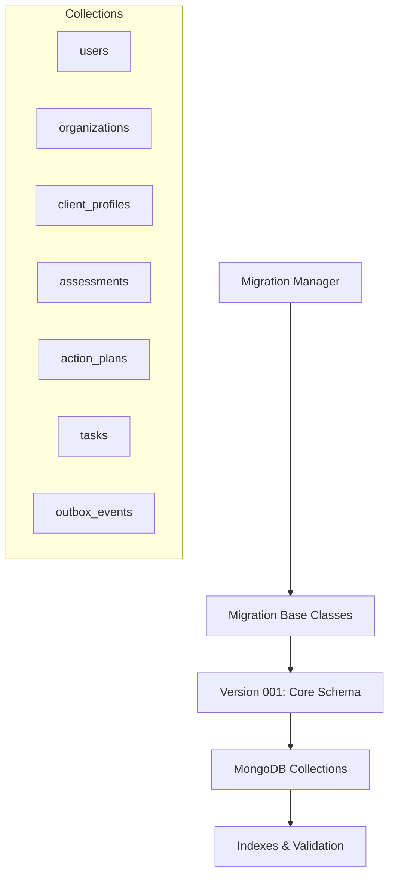
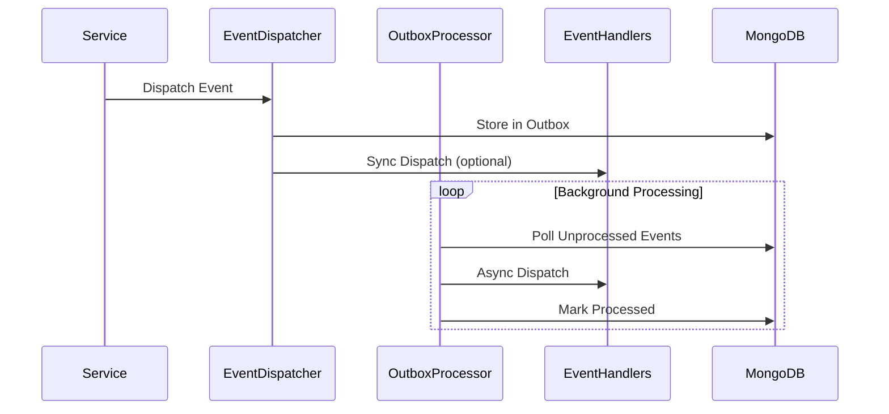
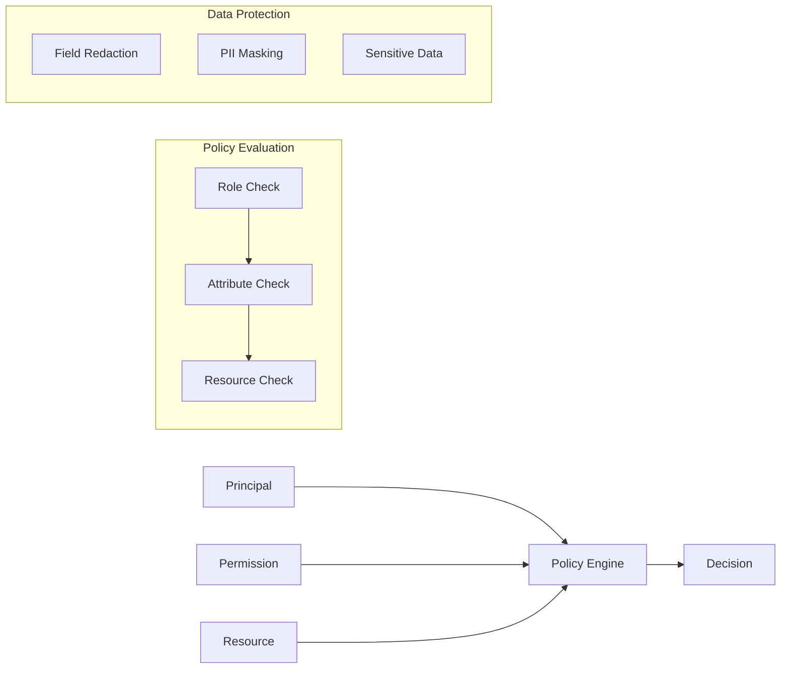
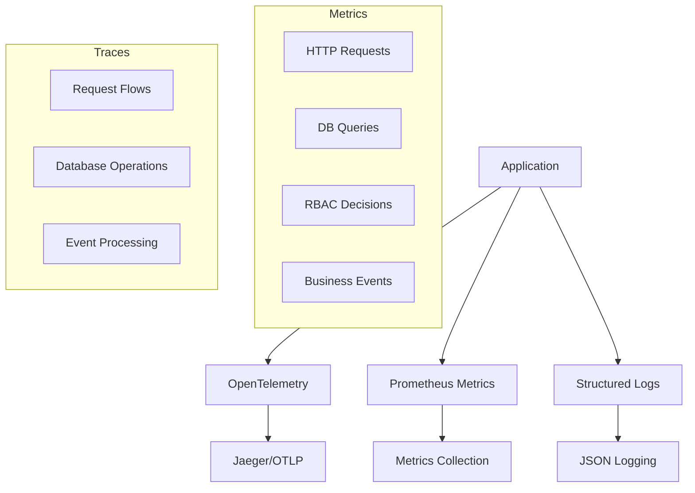
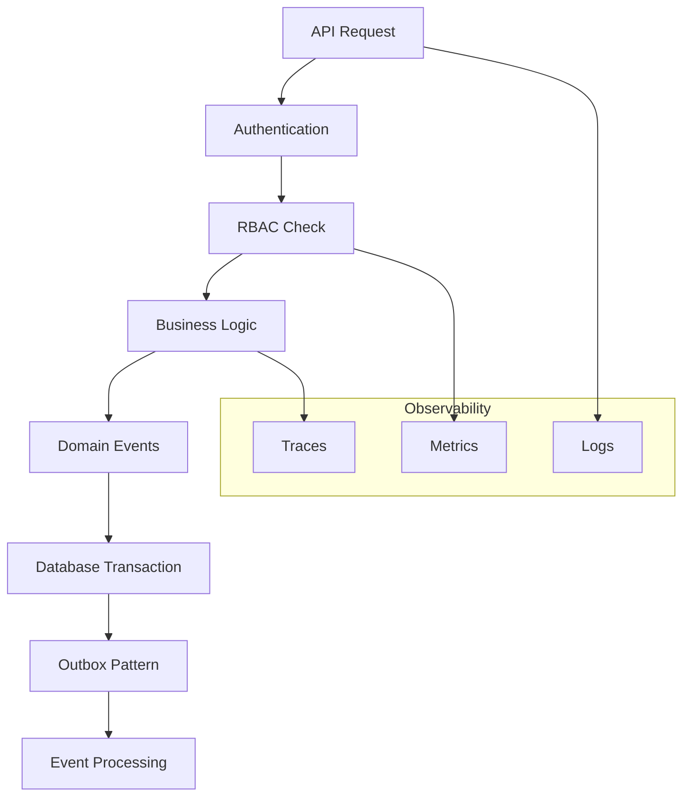

# Platform Foundations Architecture

This document describes the foundational architecture components implemented for the Polaris platform.

## Overview

The Platform Foundations provide the core infrastructure for building scalable, observable, and secure business applications. The implementation follows Domain-Driven Design principles with event sourcing, comprehensive RBAC, and modern observability practices.

## Core Components

### 1. Database Schema & Migration System

**Technology**: MongoDB with custom migration framework
**Location**: `backend/migrations/`



**Key Features**:
- Versioned migrations with up/down support
- JSON schema validation for document structure
- Comprehensive indexing strategy
- Foreign key equivalent constraints

### 2. Domain Event Infrastructure

**Technology**: Custom event sourcing with MongoDB outbox pattern
**Location**: `backend/domain/events.py`



**Event Types**:
- User lifecycle: `user.created`, `user.updated`
- Client management: `client.profile_created`, `client.assigned`
- Assessment flow: `assessment.completed`, `assessment.scored`
- Action planning: `action_plan.created`, `action_plan.published`
- Task management: `task.created`, `task.state_changed`

### 3. RBAC Policy Engine

**Technology**: Attribute-based access control with MongoDB
**Location**: `backend/rbac/`



**Roles & Permissions**:
- **SuperAdmin**: Full system access
- **OrgAdmin**: Organization-level administration
- **ProviderStaff**: Provider service delivery
- **CaseManager**: Direct client services
- **Analyst**: Data analysis and reporting
- **ClientUser**: Self-service access
- **SystemService**: Automated operations

**Performance Target**: < 5ms average policy evaluation

### 4. Observability Infrastructure

**Technology**: OpenTelemetry + Prometheus + Structured Logging
**Location**: `backend/observability/`



**Metrics Collected**:
- HTTP: request count, duration, status codes
- Database: query duration, connection pool
- RBAC: decision count, evaluation time
- Business: assessments completed, action plans created

### 5. Health Monitoring

**Endpoints**: `/health/system`, `/health/database`, `/health/external`
**SLA Targets**:
- System health: < 100ms
- Database health: < 200ms
- External services: < 500ms

```mermaid
graph LR
    A[Load Balancer] --> B[/health/live]
    A --> C[/health/ready]
    
    B --> D[Liveness Check]
    C --> E[Readiness Check]
    
    E --> F[Database]
    E --> G[External APIs]
    E --> H[System Resources]
```

## Data Flow Architecture



## Security Model

### Authentication Flow
1. JWT token validation
2. User status verification
3. Correlation ID assignment
4. Request logging

### Authorization Flow
1. Role-based permission check
2. Organization membership validation
3. Resource ownership verification
4. Attribute-based constraints

### Data Protection
1. Field-level redaction
2. PII masking
3. Sensitive data access controls
4. Audit trail maintenance

## Development Workflow

### Local Development
```bash
# Setup environment
make bootstrap

# Run migrations
make migrate

# Seed sample data
make seed

# Start development server
make run-dev
```

### Testing Strategy
```bash
# Run all tests
make test

# Unit tests only
make test-unit

# Integration tests
make test-integration

# Performance benchmarks
make benchmark
```

### Container Development
```bash
# Start full stack
make docker-compose-up

# View services
# - Application: http://localhost:8000
# - MongoDB: localhost:27017
# - Jaeger: http://localhost:16686
# - Prometheus: http://localhost:9090
# - Grafana: http://localhost:3000
```

## Performance Characteristics

### Database Operations
- Simple queries: < 1ms
- Complex aggregations: < 10ms
- Migration operations: < 30s

### RBAC Evaluation
- Average decision time: < 5ms
- 95th percentile: < 10ms
- Cache hit ratio: > 80%

### API Response Times
- Health checks: < 100ms
- Simple CRUD: < 200ms
- Complex business logic: < 500ms

## Monitoring & Alerting

### Key Metrics
- HTTP error rate < 1%
- Database query time p95 < 50ms
- RBAC decision time p95 < 10ms
- Event processing latency < 1s

### Alert Conditions
- High error rates (> 5%)
- Slow database queries (> 100ms)
- Failed health checks
- High memory usage (> 85%)

## Next Steps

### Immediate Extensions
1. **API Layer**: REST endpoints with RBAC integration
2. **Workflow Engine**: Business process automation
3. **Analytics**: Event-driven metrics and dashboards
4. **Security Hardening**: Encryption and audit enhancements

### Future Enhancements
1. **Multi-tenancy**: Organization isolation
2. **Event Streaming**: Kafka/Redis streams
3. **Machine Learning**: Predictive analytics
4. **Federation**: Multi-region deployment

## Configuration

### Environment Variables
```bash
# Database
MONGO_URL=mongodb://localhost:27017
DB_NAME=polaris_dev

# Observability
ENABLE_TRACING=true
ENABLE_METRICS=true
OTEL_EXPORTER_OTLP_ENDPOINT=http://jaeger:14250

# Security
JWT_SECRET=your-secret-key
CORS_ORIGINS=http://localhost:3000

# Performance
LOG_LEVEL=INFO
PROMETHEUS_PORT=8090
```

### Docker Compose Services
- **app**: Main application server
- **mongodb**: Document database
- **redis**: Caching and sessions
- **jaeger**: Distributed tracing
- **prometheus**: Metrics collection
- **grafana**: Metrics visualization

This architecture provides a solid foundation for building scalable, observable, and secure business applications while maintaining development velocity and operational excellence.