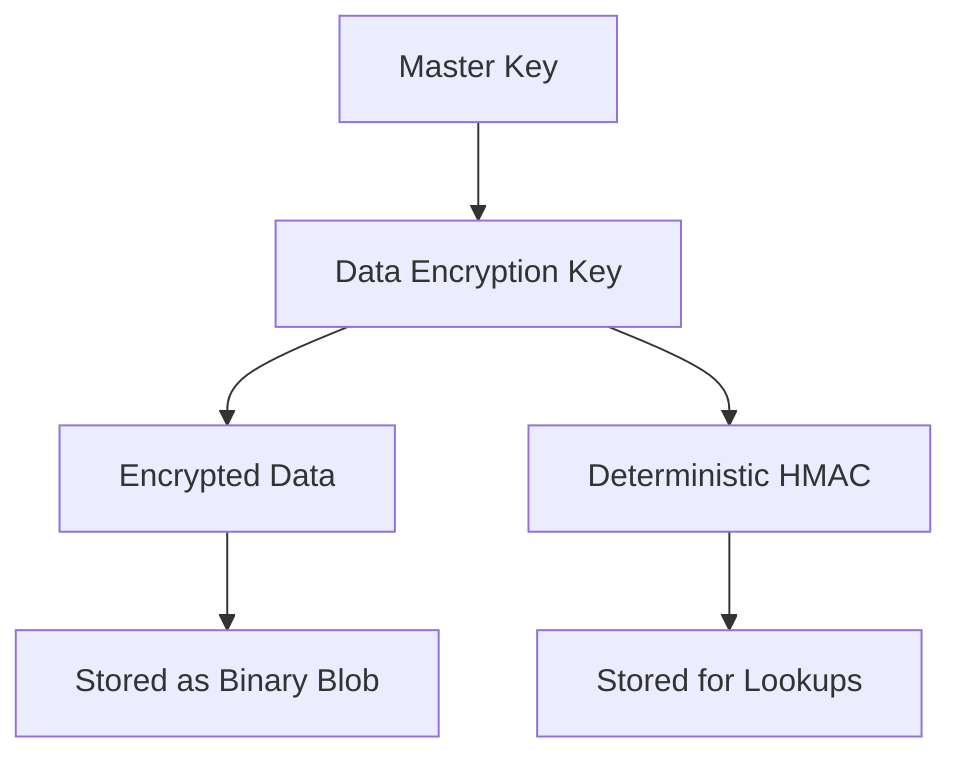
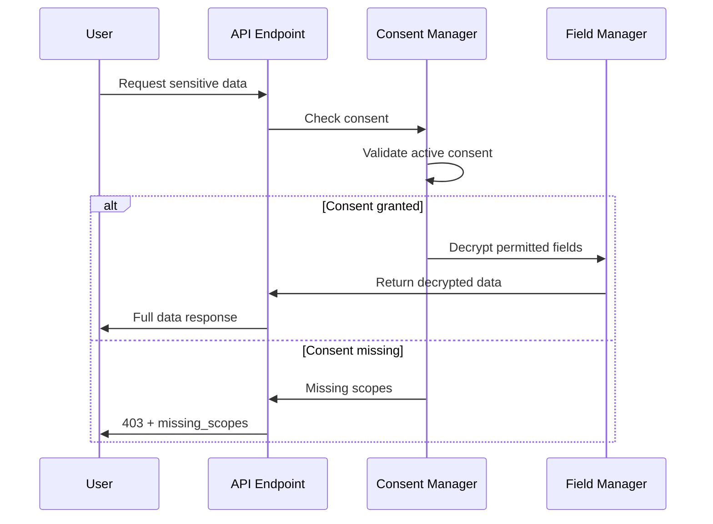

# Security, Encryption & Consent Architecture

## Overview

This document outlines the Security, Encryption & Consent Baseline implementation for the Polaris platform. The system provides field-level encryption, consent-driven access control, and comprehensive audit logging to protect sensitive client data and ensure compliance.

## Architecture Components

### 1. Encryption System

#### Envelope Encryption Pattern
- **Master Key**: Stored in environment variable `MASTER_KEY_MATERIAL` (MVP) or external KMS (future)
- **Data Encryption Keys (DEKs)**: 256-bit AES keys for actual data encryption
- **Key Wrapping**: DEKs wrapped with master key using XOR (MVP - not production grade)



#### Encryption Format
Encrypted blobs contain:
- Version (1 byte)
- Key ID (16 bytes)
- IV (12 bytes)
- Ciphertext (variable)
- Authentication Tag (16 bytes)

### 2. Field-Level Encryption

#### Encrypted Fields
| Resource | Field | Deterministic | Purpose |
|----------|-------|---------------|---------|
| client_profiles | ssn | Yes | SSN with lookup capability |
| client_profiles | address_line1 | No | Address information |
| client_profiles | address_line2 | No | Address information |
| client_profiles | phone | No | Phone number |
| assessments | notes | No | Confidential assessment notes |

#### Storage Pattern
```json
{
  "ssn_encrypted": "<binary_blob>",
  "ssn_hmac": "deterministic_hash_for_lookup",
  "address_line1_encrypted": "<binary_blob>",
  "notes_encrypted": "<binary_blob>"
}
```

### 3. Consent Management

#### Consent Scopes
- `VIEW_SENSITIVE_IDENTIFIERS`: Access to SSN, full address, phone
- `VIEW_CONFIDENTIAL_NOTES`: Access to assessment notes

#### Consent Flow


### 4. Database Schema

#### New Collections

**encryption_keys**
```javascript
{
  _id: "uuid",
  key_alias: "client_data_key",
  material_wrapped: BinData,
  algorithm: "AES256_GCM",
  active: true,
  created_at: ISODate,
  rotated_at: null
}
```

**encryption_field_metadata**
```javascript
{
  _id: "uuid", 
  resource: "client_profiles",
  field_name: "ssn",
  key_id: "uuid_ref",
  deterministic: true,
  created_at: ISODate,
  updated_at: ISODate
}
```

**consent_records**
```javascript
{
  _id: "uuid",
  client_id: "uuid", 
  scope: "VIEW_SENSITIVE_IDENTIFIERS",
  granted_at: ISODate,
  revoked_at: null,
  granted_by_user_id: "uuid",
  notes: "Consent for support case #123"
}
```

#### Enhanced audit_logs
```javascript
{
  _id: "uuid",
  timestamp: ISODate,
  user_id: "uuid",
  action: "UPDATE_SENSITIVE_FIELDS",
  resource: "client_profiles", 
  resource_id: "client_uuid",
  before_hash: "{field: hash}",
  after_hash: "{field: hash}",
  field_mask: ["ssn", "phone"],
  ip_address: "192.168.1.1"
}
```

### 5. API Endpoints

#### Consent Management
```http
POST /api/security/clients/{id}/consents
{
  "scope": "VIEW_SENSITIVE_IDENTIFIERS",
  "notes": "Support ticket #123"
}

POST /api/security/clients/{id}/consents/revoke
{
  "scope": "VIEW_SENSITIVE_IDENTIFIERS" 
}

GET /api/security/clients/{id}/consents?include_revoked=false
```

#### Encryption Introspection
```http
GET /api/security/encryption/fields
```

#### Key Rotation (Admin Only)
```http
POST /api/security/rotate-keys
{
  "key_alias": "client_data_key",
  "batch_size": 100
}

GET /api/security/rotate-keys/{rotation_id}
```

### 6. Security Considerations

#### Threat Model (MVP Scope)
- **In Scope**: Field-level data exposure, unauthorized data access
- **Out of Scope**: Advanced persistent threats, side-channel attacks
- **Assumptions**: Secure network transport, trusted operators

#### Current Limitations
- XOR key wrapping is not production-grade
- No external KMS integration yet
- Simple RBAC permission model
- Basic key rotation implementation

#### Future Enhancements
- External KMS adapter (AWS KMS, GCP KMS, Azure Key Vault)
- Format-Preserving Encryption for structured identifiers
- Attribute-based access control (ABAC)
- Automated consent expiry policies
- Differential privacy layers

### 7. Key Rotation Process

#### Rotation Steps
1. Generate new encryption key, mark as active
2. Process encrypted data in batches:
   - Decrypt with old key
   - Re-encrypt with new key
   - Update field metadata
3. Mark old key as inactive
4. Update rotation state tracking

#### Rollback Procedure
1. Mark new key as inactive
2. Revert field metadata to old key
3. Re-encrypt affected data with old key
4. Log rollback event

### 8. Monitoring & Observability

#### Key Metrics
- `encryption_operations_total{operation=encrypt|decrypt, field}`
- `encryption_failures_total{reason}`
- `consent_checks_total{scope, result}`
- `key_rotation_duration_seconds`
- `sensitive_field_access_total{field, outcome}`

#### Audit Events
- `consent_granted`, `consent_revoked`
- `key_rotation_start`, `key_rotation_complete`
- `sensitive_field_access`
- `encryption_key_created`, `encryption_key_rotated`

### 9. Configuration

#### Environment Variables
```bash
# Core encryption
MASTER_KEY_MATERIAL=<base64_encoded_32_bytes>
ENABLE_FIELD_ENCRYPTION=true
ENABLE_CONSENT_ENFORCEMENT=true

# Key rotation
ENABLE_KEY_ROTATION=false

# Database
MONGO_URL=mongodb://localhost:27017
DB_NAME=polaris_db
```

#### Feature Flags
- `ENABLE_FIELD_ENCRYPTION`: Master switch for encryption features
- `ENABLE_CONSENT_ENFORCEMENT`: Master switch for consent checking
- `ENABLE_KEY_ROTATION`: Admin key rotation capabilities

### 10. Testing Strategy

#### Unit Tests
- Encryption/decryption roundtrip
- Deterministic hashing consistency
- Consent permission matrix
- Field masking behavior

#### Integration Tests
- End-to-end encrypted field access
- Consent enforcement middleware
- API endpoint security
- Key rotation simulation

#### Security Tests
- Encrypted data remains encrypted at rest
- Unauthorized access returns masked data
- Audit trails capture sensitive operations
- Rate limiting prevents brute force

### 11. Compliance Alignment

#### HIPAA Considerations
- Field-level encryption of PHI
- Access logging and audit trails
- Consent-based access controls
- Data minimization through field masking

#### SOC2 Foundations
- Encryption key management
- Access control enforcement
- Comprehensive audit logging
- Security monitoring metrics

### 12. Implementation Notes

#### Development Environment
- Simplified key management for local testing
- In-memory rate limiting (production should use Redis)
- Permissive error handling to avoid breaking existing functionality

#### Production Readiness
- External KMS integration required
- Persistent rate limiting storage
- Enhanced monitoring and alerting
- Formal key rotation procedures

---

## Quick Start

1. **Initialize Database**:
   ```bash
   python backend/init_security_db.py
   ```

2. **Set Environment Variables**:
   ```bash
   export MASTER_KEY_MATERIAL=$(python -c "import base64, secrets; print(base64.b64encode(secrets.token_bytes(32)).decode())")
   export ENABLE_FIELD_ENCRYPTION=true
   export ENABLE_CONSENT_ENFORCEMENT=true
   ```

3. **Run Tests**:
   ```bash
   python backend/test_security.py
   ```

4. **Grant Consent**:
   ```bash
   curl -X POST /api/security/clients/{id}/consents \
     -d '{"scope": "VIEW_SENSITIVE_IDENTIFIERS"}'
   ```

5. **Access Encrypted Data**:
   ```bash
   curl /api/clients/{id}/profile-secure
   ```