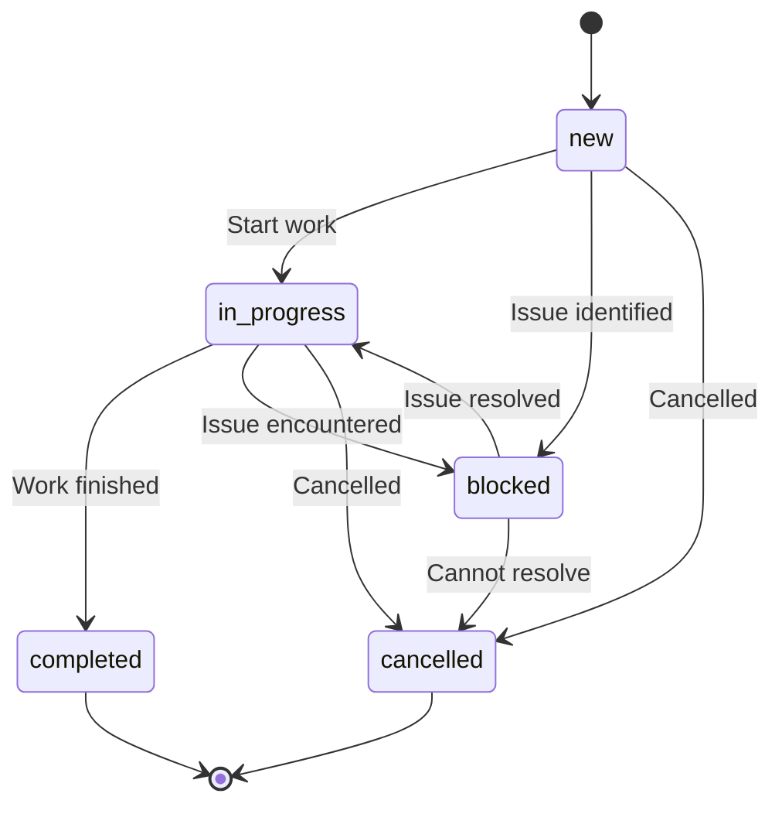
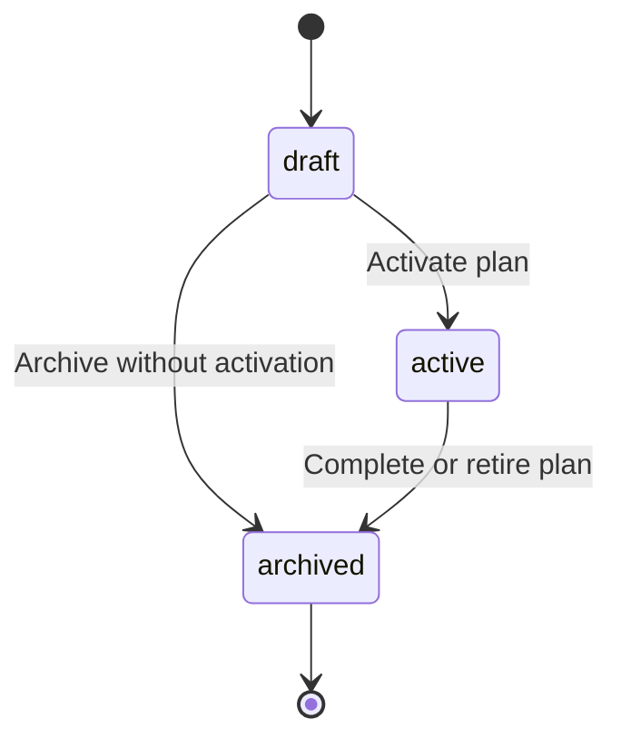
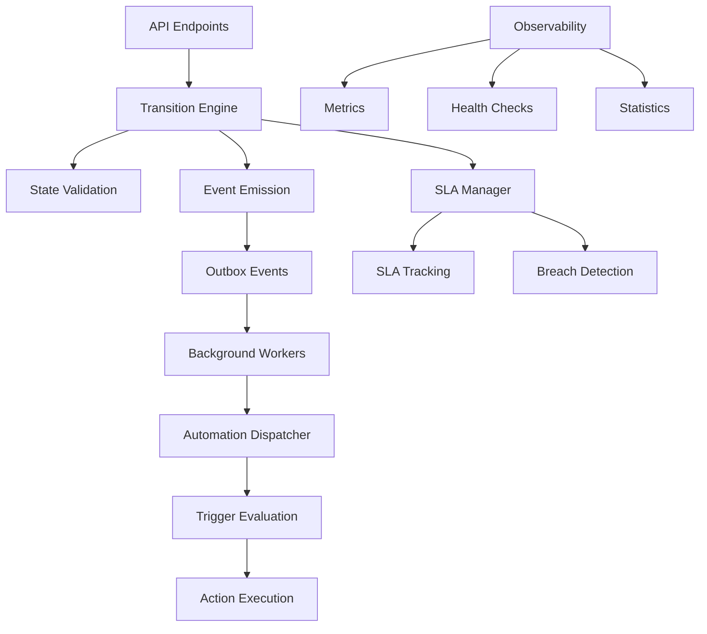
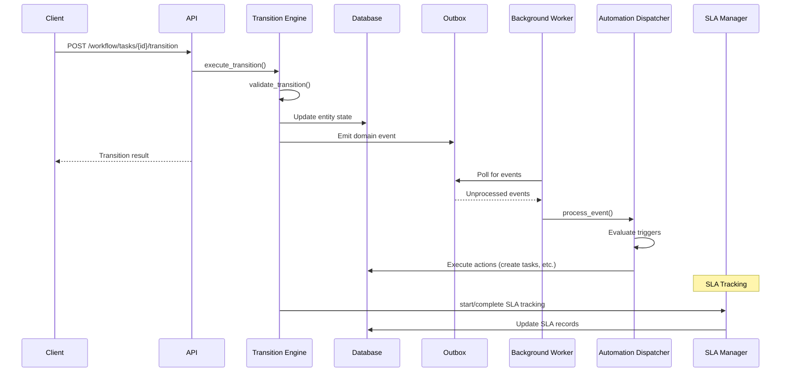

# Workflow Orchestration and Automation Layer

## Overview

The Workflow Orchestration and Automation Layer provides deterministic state management, automation triggers, and SLA tracking for the Polaris platform. This system establishes the foundation for AI recommendations, analytics enrichment, and SLA breach detection.

## Architecture

### State Machines

#### Task Lifecycle State Machine



#### ActionPlan Lifecycle State Machine



### System Components



### Event Flow Sequence



## Features

### 1. State Management

- **Deterministic State Machines**: Explicit state definitions for Tasks and ActionPlans
- **Transition Validation**: Guard conditions and business rule enforcement
- **Event-Driven Architecture**: Domain events for all state changes

### 2. Automation Framework

- **Trigger System**: Event-based automation with predicate evaluation
- **Action Execution**: Support for task creation, state updates, alerts, webhooks
- **Extensible Design**: Easy addition of new triggers and actions

### 3. SLA Tracking

- **Configuration Management**: Flexible SLA definitions by service area and task type
- **Automatic Tracking**: Start/stop tracking based on state transitions
- **Breach Detection**: Background monitoring with alerting capabilities

### 4. Background Processing

- **Event Processing**: Reliable processing of domain events
- **Worker Management**: Async workers with error handling and retry logic
- **Scheduled Tasks**: SLA monitoring and maintenance operations

### 5. Observability

- **Metrics**: Prometheus-compatible metrics for monitoring
- **Health Checks**: System health and statistics endpoints
- **Tracing**: Request correlation and performance tracking

## API Endpoints

### Task Management

#### Create Task
```http
POST /api/workflow/tasks
Content-Type: application/json

{
  "title": "Process Application",
  "description": "Review and process new application",
  "task_type": "intake",
  "priority": "high",
  "assigned_to": "user123",
  "due_date": "2024-01-15T10:00:00Z"
}
```

#### Transition Task State
```http
POST /api/workflow/tasks/{task_id}/transition
Content-Type: application/json

{
  "target_state": "in_progress",
  "context": {
    "reason": "Starting work",
    "estimated_completion": "2024-01-15T12:00:00Z"
  },
  "notes": "Beginning task execution"
}
```

#### Get Task Details
```http
GET /api/workflow/tasks/{task_id}
```

#### List Tasks
```http
GET /api/workflow/tasks?state=in_progress&task_type=intake&limit=50
```

### ActionPlan Management

#### Create ActionPlan
```http
POST /api/workflow/action-plans
Content-Type: application/json

{
  "title": "Q1 Compliance Plan",
  "description": "Quarterly compliance action plan",
  "goals": [
    "Complete all pending assessments",
    "Update compliance documentation",
    "Schedule quarterly review"
  ]
}
```

#### Activate ActionPlan
```http
POST /api/workflow/action-plans/{action_plan_id}/activate
```

#### Archive ActionPlan
```http
POST /api/workflow/action-plans/{action_plan_id}/archive
```

### Workflow Metadata

#### Get Workflow Metadata
```http
GET /api/workflow/metadata
```

Returns state machine definitions, allowed transitions, and business rules for UI introspection.

### SLA Management

#### Create SLA Configuration
```http
POST /api/workflow/sla-configs
Content-Type: application/json

{
  "service_area": "intake",
  "target_minutes": 60,
  "task_type": "intake",
  "active": true
}
```

#### List SLA Configurations
```http
GET /api/workflow/sla-configs?active_only=true
```

### Monitoring

#### Get Workflow Statistics
```http
GET /api/workflow/stats
```

Returns comprehensive workflow statistics including task counts by state, SLA metrics, and event processing status.

## Testing

### Running Tests

```bash
# Run all workflow tests
cd backend
python test_workflow.py

# Run with pytest (if available)
pytest test_workflow.py -v
```

### Test Coverage

- State machine validation
- Transition engine functionality
- Automation trigger evaluation
- SLA tracking and breach detection
- API endpoint integration
- Background worker processing
- Error handling and edge cases

## Configuration

### Environment Variables

```bash
# Database Configuration
MONGO_URL=mongodb://localhost:27017
DB_NAME=polaris_db

# Workflow Configuration
WORKFLOW_ENABLED=true
WORKFLOW_WORKER_INTERVAL=5  # seconds
SLA_MONITOR_INTERVAL=300    # seconds (5 minutes)

# Observability
METRICS_ENABLED=true
PROMETHEUS_PORT=9090
```

### Default SLA Configurations

The system includes default SLA configurations:

- **Intake Tasks**: 1 hour (60 minutes)
- **Assessment Tasks**: 4 hours (240 minutes)
- **Review Tasks**: 2 hours (120 minutes)
- **General Tasks**: 8 hours (480 minutes)

## Automation Triggers

### Built-in Triggers

#### Task Completion Follow-up
- **Trigger**: Task with type "intake" completes
- **Action**: Create assessment task with high priority
- **Purpose**: Ensure follow-up work is automatically scheduled

#### ActionPlan Activation Notification
- **Trigger**: ActionPlan is activated
- **Action**: Emit notification alert
- **Purpose**: Notify stakeholders of plan activation

### Adding Custom Triggers

Triggers are defined in the `AUTOMATION_TRIGGERS` list in `workflow.py`:

```python
AutomationTrigger(
    id="custom_trigger",
    event_type="TaskStateChanged",
    predicate="event_data.get('new_state') == 'blocked' and event_data.get('priority') == 'critical'",
    actions=[
        AutomationAction(
            action_type="emit_alert",
            parameters={
                "alert_type": "critical_task_blocked",
                "message": "Critical task blocked",
                "escalate": True
            }
        )
    ],
    description="Alert when critical tasks are blocked"
)
```

## Permissions and RBAC

### Required Permissions

- **UPDATE_TASK**: Required for task state transitions
- **CREATE_TASK**: Required for task creation
- **CREATE_ACTION_PLAN**: Required for action plan operations
- **ACTIVATE_ACTION_PLAN**: Required for action plan activation (may be separate from CREATE_ACTION_PLAN)
- **MANAGE_SLA**: Required for SLA configuration management (admin/agency only)

### Permission Checks

The system integrates with existing RBAC:
- Users can transition tasks they created or are assigned to
- Admin and agency roles have broader permissions
- SLA management restricted to admin/agency roles
- Workflow statistics access restricted to admin/agency roles

## Database Schema

### Collections

#### tasks
```javascript
{
  id: String (unique),
  title: String,
  description: String,
  state: String, // TaskState enum
  created_at: DateTime,
  updated_at: DateTime,
  created_by: String, // user_id
  assigned_to: String, // user_id
  action_plan_id: String,
  task_type: String,
  priority: String,
  due_date: DateTime,
  metadata: Object
}
```

#### actionplans
```javascript
{
  id: String (unique),
  title: String,
  description: String,
  state: String, // ActionPlanState enum
  created_at: DateTime,
  updated_at: DateTime,
  created_by: String, // user_id
  goals: [String],
  metadata: Object
}
```

#### sla_configs
```javascript
{
  id: String (unique),
  service_area: String,
  target_minutes: Number,
  active: Boolean,
  task_type: String,
  created_at: DateTime
}
```

#### sla_records
```javascript
{
  id: String (unique),
  task_id: String,
  sla_config_id: String,
  started_at: DateTime,
  completed_at: DateTime,
  breached: Boolean,
  actual_minutes: Number,
  target_minutes: Number,
  created_at: DateTime
}
```

#### outbox_events
```javascript
{
  id: String (unique),
  event_type: String,
  aggregate_id: String,
  aggregate_type: String,
  event_data: Object,
  correlation_id: String,
  actor_id: String,
  processed: Boolean,
  created_at: DateTime,
  processed_at: DateTime
}
```

## Metrics

### Prometheus Metrics

The system exposes the following metrics:

- `workflow_transition_total{entity_type, result}`: Total transitions
- `automation_trigger_evaluations_total{trigger_id, outcome}`: Trigger evaluations
- `sla_records_breached_total`: SLA breaches
- `outbox_events_processed_total{event_type, status}`: Event processing
- `active_tasks_total{state}`: Active tasks by state

## Error Handling

### Transition Failures

Invalid transitions return HTTP 400 with machine-readable error codes:

```json
{
  "success": false,
  "message": "Transition from in_progress to new not allowed",
  "error_code": "INVALID_TRANSITION",
  "details": {
    "current_state": "in_progress",
    "target_state": "new",
    "entity_type": "Task"
  }
}
```

### Permission Failures

Insufficient permissions return HTTP 403:

```json
{
  "detail": "Insufficient permissions",
  "error_code": "PERMISSION_DENIED"
}
```

## Migration

### Database Setup

Run the migration script to create collections and indexes:

```bash
cd backend
python workflow_migration.py
```

This creates:
- Required collections with proper indexes
- Default SLA configurations
- Verification of setup

### Integration Steps

1. **Install Dependencies**: Ensure all workflow dependencies are available
2. **Run Migration**: Execute database migration script
3. **Update Environment**: Set workflow configuration variables
4. **Deploy Backend**: Deploy updated backend with workflow integration
5. **Verify Setup**: Check workflow endpoints and background workers
6. **Monitor Metrics**: Ensure metrics collection is working

## Future Enhancements

### Planned Features

1. **Persistent Trigger Configuration**: UI-managed automation rules
2. **Time-based Triggers**: Cron-based scheduled automation
3. **External Webhook Delivery**: Reliable webhook processing
4. **Advanced Predicates**: Full DSL for trigger conditions
5. **AI Integration**: Machine learning for task prioritization
6. **Analytics Events**: Enhanced event sourcing for analytics
7. **Workflow Templates**: Predefined workflow patterns
8. **Escalation Policies**: Automatic escalation for SLA breaches

### Performance Optimizations

1. **Event Batching**: Process multiple events in batches
2. **Caching Layer**: Cache frequently accessed data
3. **Horizontal Scaling**: Multi-instance worker deployment
4. **Database Optimization**: Advanced indexing and partitioning

## Troubleshooting

### Common Issues

#### Workers Not Starting
- Check database connectivity
- Verify workflow is enabled in configuration
- Check log files for error messages

#### Events Not Processing
- Verify outbox events are being created
- Check worker status and error logs
- Ensure automation triggers are active

#### SLA Tracking Issues
- Verify SLA configurations exist
- Check task type mappings
- Review SLA record creation logs

#### Permission Errors
- Verify user roles and permissions
- Check RBAC integration
- Review authentication middleware

### Debug Commands

```bash
# Check workflow status
curl -H "Authorization: Bearer $TOKEN" \
     http://localhost:8000/api/workflow/stats

# View workflow metadata
curl http://localhost:8000/api/workflow/metadata

# Check SLA configurations
curl -H "Authorization: Bearer $TOKEN" \
     http://localhost:8000/api/workflow/sla-configs
```

## Support

For issues or questions about the workflow orchestration system:

1. Check this documentation first
2. Review log files for error messages
3. Verify configuration and permissions
4. Test with simple workflows first
5. Contact the development team with specific error details

## Implementation Notes

### Key Design Decisions

1. **Event-Driven Architecture**: All state changes emit domain events for automation
2. **Outbox Pattern**: Reliable event processing using database outbox
3. **State Machine Validation**: Explicit validation before state transitions
4. **Background Processing**: Asynchronous workers for automation and monitoring
5. **Observability First**: Built-in metrics and monitoring capabilities

### Security Considerations

1. **Permission-Based Access**: All operations check user permissions
2. **Data Validation**: Input validation on all API endpoints
3. **Audit Trail**: All state changes are logged with actor information
4. **Resource Isolation**: Users can only access their own resources (unless admin)

### Scalability Features

1. **Horizontal Worker Scaling**: Multiple worker instances can process events
2. **Database Indexing**: Optimized indexes for query performance
3. **Event Batching**: Efficient processing of multiple events
4. **Metric Collection**: Performance monitoring and alerting

---

*This documentation covers the initial implementation of the Workflow Orchestration and Automation Layer. The system provides a solid foundation for future enhancements including AI-driven automation, advanced analytics, and sophisticated workflow management capabilities.*